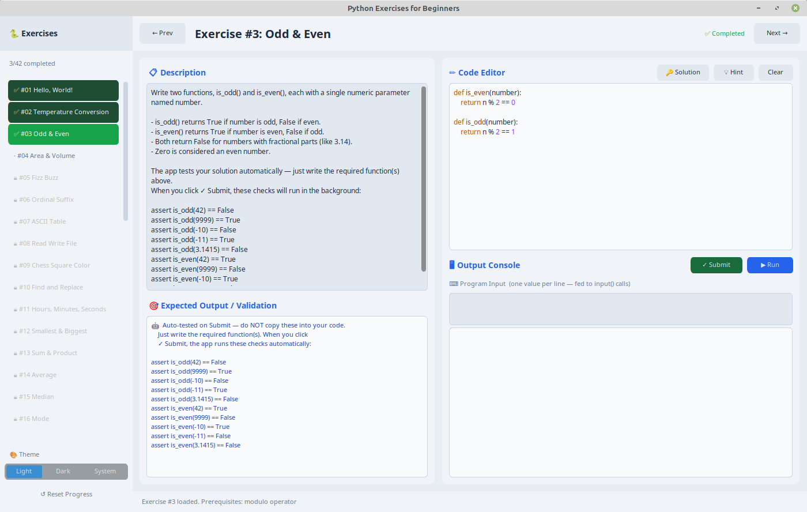

# Python Exercises for Beginners



A GUI application that guides you through all 42 Python programming exercises from
**"Python Programming Exercises, Gently Explained"** by Al Sweigart.

## Requirements

- Python 3.8+
- customtkinter library

## Installation

```bash
pip install customtkinter
```

## Running the App

```bash
python main.py
```

## Building a Standalone Executable (Optional)

You can package the app into a standalone executable that doesn't require Python to be installed on the target machine.

1. Install PyInstaller:
   ```bash
   pip install pyinstaller
   ```

2. Run the included build script:
   ```bash
   python build.py
   ```
   *(To remove previous build artifacts before building, run `python build.py --clean`)*

The final executable will be generated in the `dist/` folder.

## Features

- **42 exercises** from beginner to intermediate level
- **Code editor** with 4-space tab support
- **Run button** — executes your code and shows output
- **Submit button** — validates your solution against test cases
- **Progressive unlocking** — complete an exercise to unlock the next
- **Hint system** — shows a partial hint when you're stuck
- **Reference solutions** — view Al Sweigart's solution after you complete an exercise
- **Auto-saves** your code between sessions (stored in `~/.python_exercises/`)
- **Progress tracking** — picks up where you left off

## How It Works

1. Read the exercise description on the left panel
2. Check the expected output / validation rules below the description
3. Write your Python code in the editor on the right
4. Click **▶ Run** to test your code and see output
5. Click **✓ Submit** to validate your solution
6. If it passes, the next exercise unlocks automatically!
7. After completing an exercise, click **🔑 Solution** to compare with the book's solution

## Exercise List

Exercises 1–42 covering: print/input, functions, math operators, modulo, loops,
file I/O, lists, dictionaries, strings, random numbers, sorting algorithms, and more.

## Notes

- Your solutions are saved to `my_solutions/` inside the app folder
- Progress is saved to `progress.json` inside the app folder
- The app runs your code in a subprocess with a 10-second timeout
- For programs that use `input()`, type your input in the **⌨️ Program Input** box before clicking ▶ Run

## Naming Convention Note

This app uses **PEP 8 snake_case** for all function and variable names (e.g. `fizz_buzz`, `is_leap_year`), which is the official Python style guide standard.

Al Sweigart's original book uses camelCase (e.g. `fizzBuzz`, `isLeapYear`). If you reference the book alongside this app, the function names will differ slightly — but the logic is identical. Learning snake_case from the start is a good habit for writing professional Python code.
